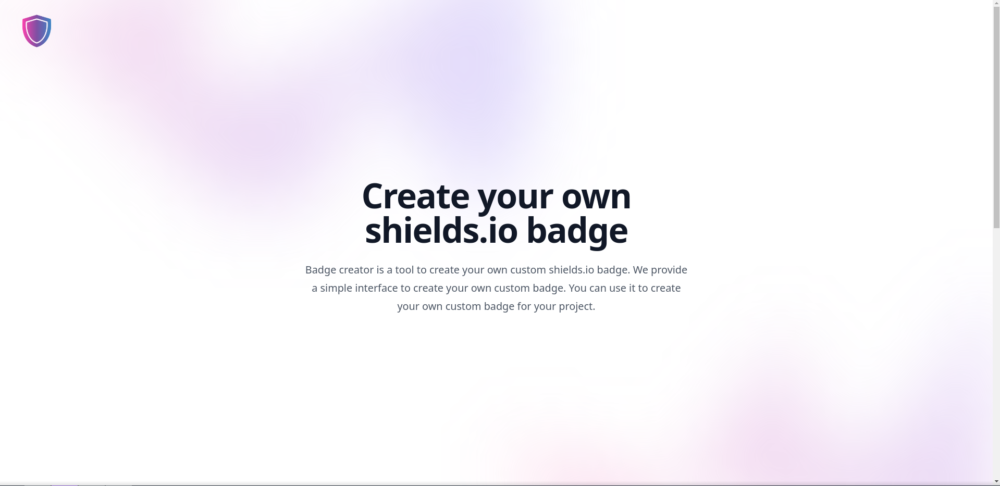
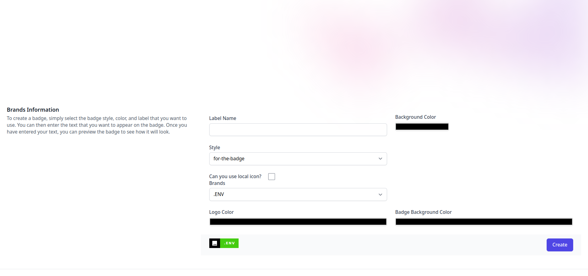
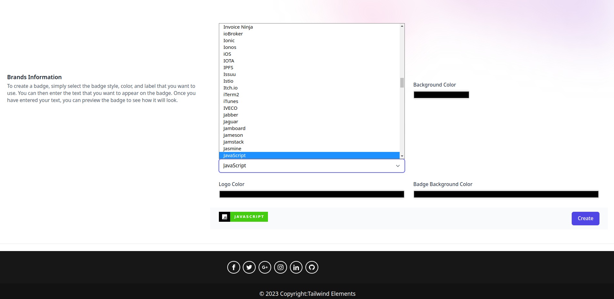
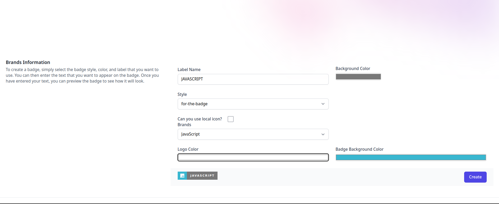
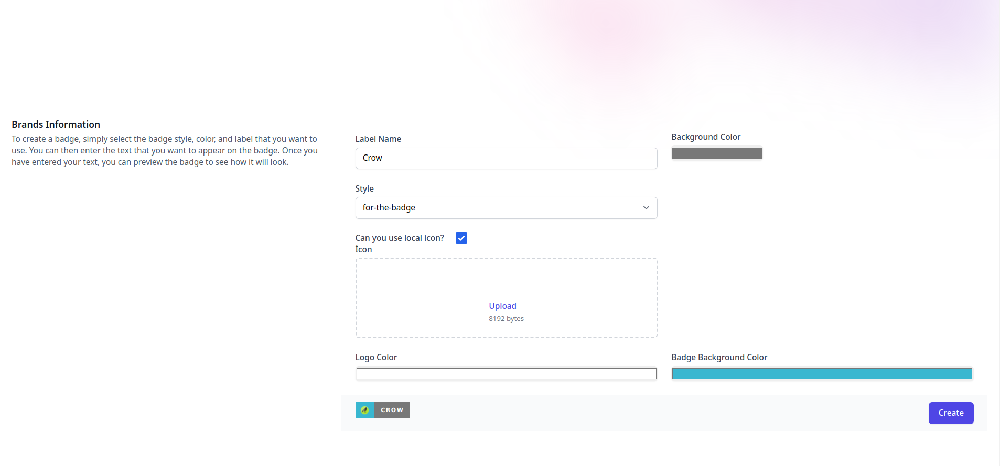
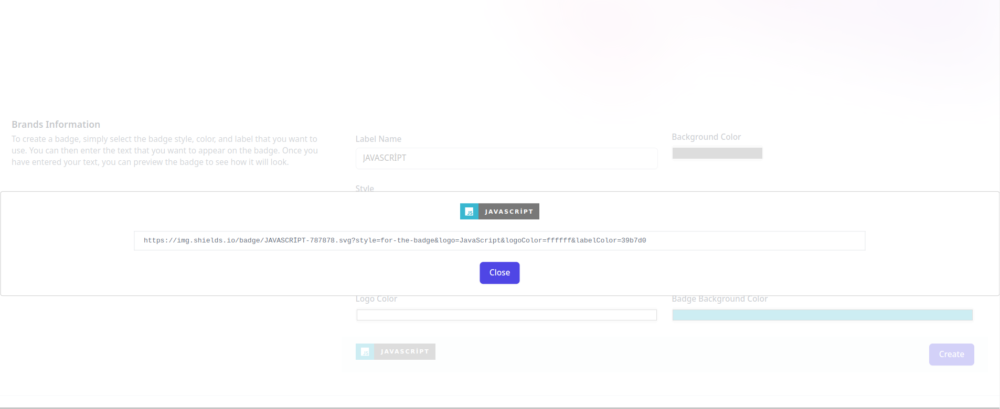

# Badge Creator

    
    

This Github repository contains the source code for a web application designed to make badge creation easier using the Shields.io infrastructure. This application is particularly useful for creating badges used in open-source projects.

The application is user-friendly and customizable. Badges can be created in different colors and with different text. Additionally, the format and size of the badge can be customized.

This application is a useful tool for web developers and open-source projects. Badges are visual elements used in promoting projects and social media sharing, and can easily be created using this application.

## Build Width 🛠️
- 
- 
- 

## Screenshots

